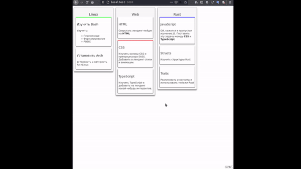

# Trello clone written on Svelte3 =)
## Motivation
This time I had to try svelte-dnd-action library. So what can be better than creating of my own trello clone?)

## Abilities & screenshots
You can drag-n-drop:
* Cards inside or between columns
* Columns inside page

You can edit column name by double-clicking on it. Input field will close when mouse leaves it.

### Demonstration abilities
* Each card can have its own color (some cards are colored in the demo)
* There could be more than one collection of columns (board)

## Building from source
`npm install`
`npm run build`